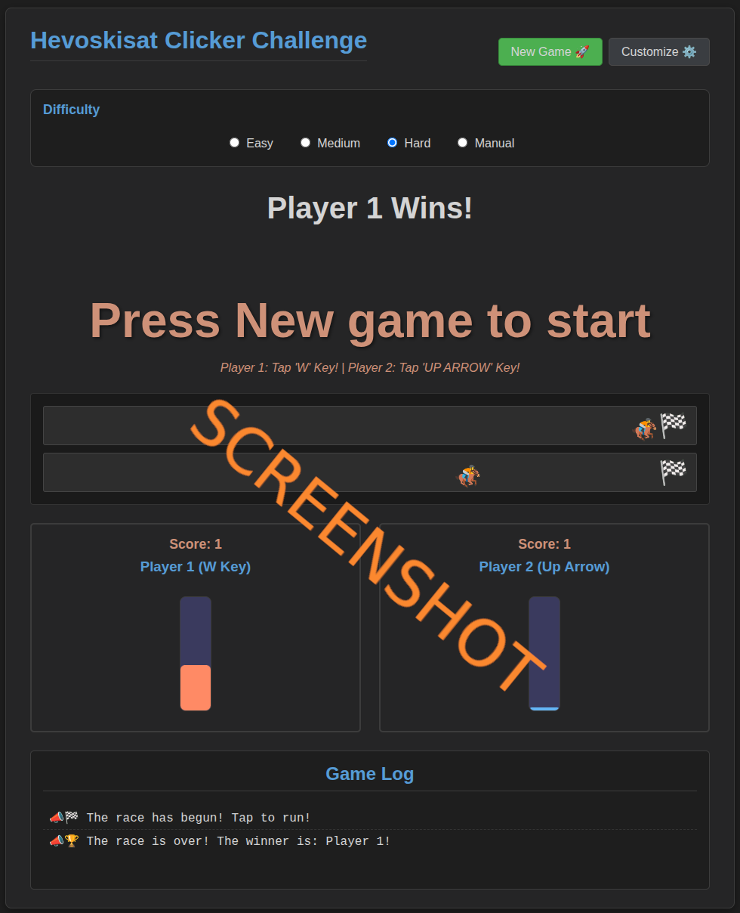

# js_horseclick

# 🏇 Hevoskisat Clicker Challenge

## Play it now: https://pemmyz.github.io/js_horseclick/

**Hevoskisat Clicker Challenge** is a fast-paced, competitive multiplayer tapping game made in pure HTML5, CSS3, and JavaScript. Tap your keys to charge force and race your chosen character to the finish line. First to cross wins!

---

## 🎮 Gameplay Overview

Compete head-to-head in a race where speed and rhythm matter! Each player taps a key **or a gamepad face button** to increase force and move forward — but watch out, your force drains over time!

- **Player 1:** `W` key (or `Shift`)  
- **Player 2:** `Arrow Up` key (or `Numpad Enter`)  
- First player to reach the finish line wins the round!  
- Play multiple rounds and keep track of scores.  

---

## 🕹 Controls (Keyboard & Gamepad)

### Join the Game
- **Keyboard:** press any player key (see defaults below).
- **Gamepad:** press **any face button** (`A/B/X/Y` on Xbox, `✕/○/□/△` on PlayStation).  
  The first available slot is assigned and shown as **(GP _index_)**.

### Default Keyboard Tapping Keys (per player)
- **Player 1:** `A` or `D`
- **Player 2:** `ArrowLeft` or `ArrowRight`
- **Player 3:** `L` or `K`
- **Player 4:** `P` or `O`

> You can remap keys in **Customize → Change**.

### Gamepad Tapping
- **Any face button** counts as a tap during the race (`A/B/X/Y` or `✕/○/□/△`).
- Your assigned gamepad is shown in the UI as **(GP 0)**, **(GP 1)**, etc.

---

## 🚦 Start System (Perfect / False Start)

Configurable in **Customize → Advanced Settings**:
- **Start Mode**
  - **Perfect Start (Single Button):** Press **your Key 1** (keyboard) or **any face button** (gamepad) exactly on **“GO!”** to get a **boost**.
  - **Perfect Start (Two Buttons):** Hit **two different inputs in sequence** on **“GO!”**  
    - **Keyboard:** press your two keys (e.g., `A` then `D`).  
    - **Gamepad:** press **two different face buttons** (e.g., `A` then `B`).  
- **False Start Penalty (optional):** Pressing **before** “GO!” causes a short **stall** at race start.
- **Start Boost:** Adjustable boost strength for perfect starts.

---

## 🤖 Bots (Optional)
- Add a player slot with **Add Player**, then enable **Bot AI** in **Customize**.  
- Set **Clicks/Sec**, **AI mode (Static/Rubberband)**, and **Perfect Start chance**.

---

## 🔊 Quick Tips
- Press **H** for the in-game **Help** overlay.
- Game auto-starts after a short countdown when **2+ players** have joined (can be canceled by opening a modal).

---

## ⚙️ Features

- 🏁 **2-Player Local Clicker Gameplay**
- 🔧 **Manual & Difficulty Settings** (Easy / Medium / Hard / Custom)
- 🚀 **Start Countdown System** with “GO!” indicator
- 🛠️ **Customization Menu**
  - Choose your racing emoji (horse, car, runner, etc.)
  - Choose control schemes (W/Arrow or Shift/Numpad)
- 📊 **Force Bars** show your stamina
- 📝 **Game Log** for match events
- 📱 Responsive layout and dark-themed design

---

## 🛠️ Customization

Click the **Customize ⚙️** button to open the modal:

- Select your racing emoji for each player:
  - 🏇 Horse
  - 🏎 Race Car
  - 🎠 Carousel
  - 🏃‍♂️ Runner
  - 🚴‍♀️ Cyclist
- Change control schemes:
  - `W` / `Arrow Up`
  - `Shift` / `Numpad Enter`

You can also set your own difficulty in **Manual Mode**, adjusting:
- **Tap Power** – How much force each tap adds
- **Force Drain Rate** – How fast the force depletes over time

---

## 🧑‍💻 Tech Stack

- HTML5
- CSS3 (Custom dark mode with CSS variables)
- JavaScript (Vanilla)

---

## 🧠 Future Ideas

- 💾 Save high scores across sessions  
- 🌍 Online multiplayer?  
- 📱 Mobile touch support  
- 🎵 Add sound effects and background music  
- 🐸 Add "AMIGAAA!" frog emoji mode?  

---

## 📜 License

**MIT License**  
Free to use, remix, and share.

